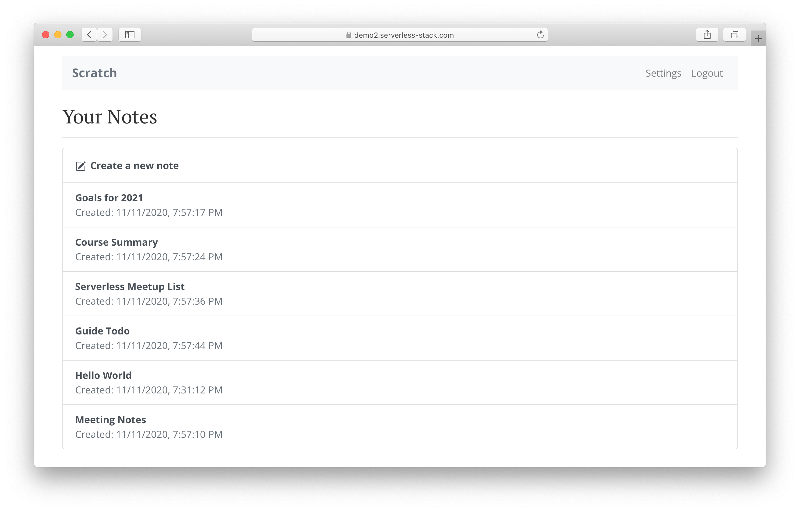
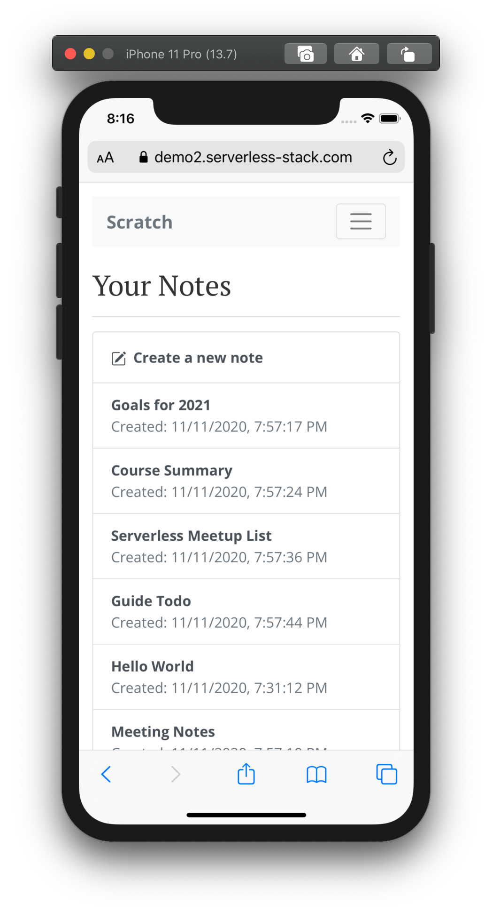

# Demo App

The demo app is a single page application powered by a serverless API written completely in JavaScript.

## Technologies & Services

The following set of technologies and services were used build the serverless application.

- Lambda & API Gateway for our serverless API
- DynamoDB for our database
- Cognito for user authentication and securing our APIs
- S3 for hosting our app and file uploads
- CloudFront for serving out our app
- Route 53 for our domain
- Certificate Manager for SSL
- CloudWatch for Lambda and API access logs
- React.js for our single page app
- React Router for routing
- Bootstrap for the UI Kit
- Stripe for processing credit card payments
- Seed for automating serverless deployments
- Netlify for automating React deployments
- GitHub for hosting our project repos
- Sentry for error reporting

## It is a relatively simple application which covers the following requirements.

- Should allow users to signup and login to their accounts
- Users should be able to create notes with some content
- Each note can also have an uploaded file as an attachment
- Allow users to modify their note and the attachment
- Users can also delete their notes
- The app should be able to process credit card payments
- App should be served over HTTPS on a custom domain
- The backend APIs need to be secure
- The app needs to be responsive
- The app should be deployed when we git push
- We should be able to monitor and debug any errors

## This app was built following the guide provided by SST.dev

### [link to the guide](https://sst.dev/chapters/who-is-this-guide-for.html)

## My applicated live site

### [Live Application](https://d1j8x1l5t1xykm.cloudfront.net/login)
